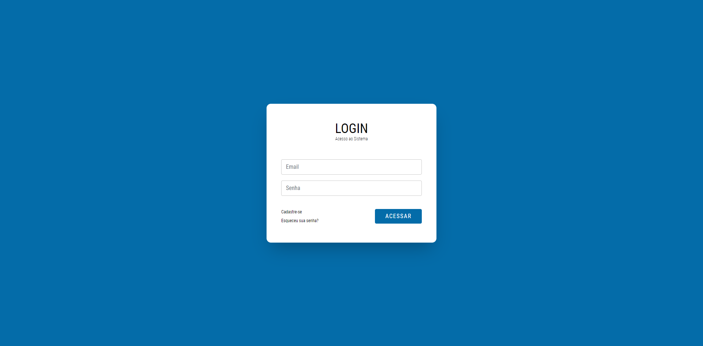
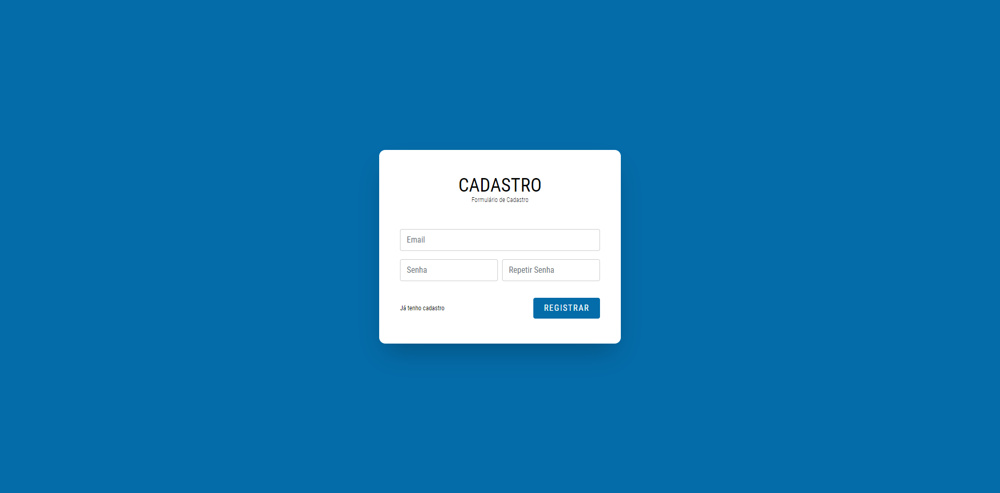
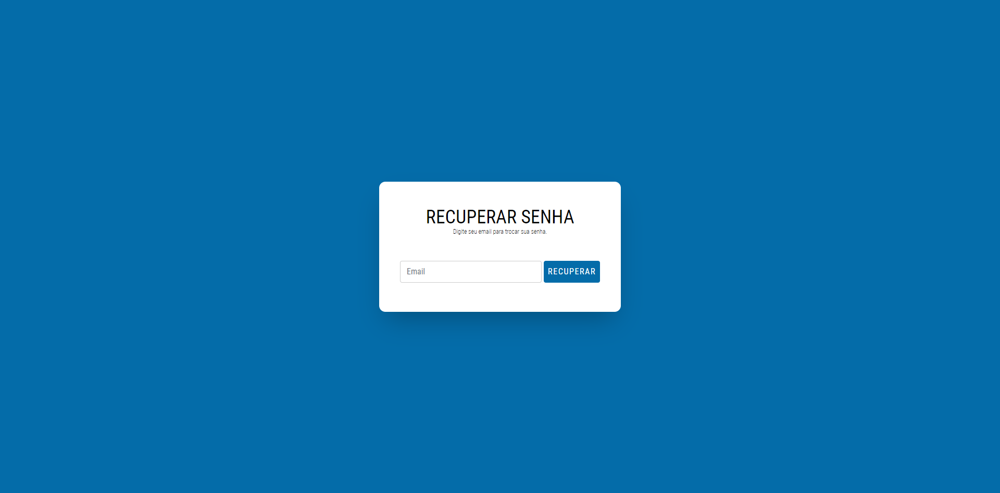
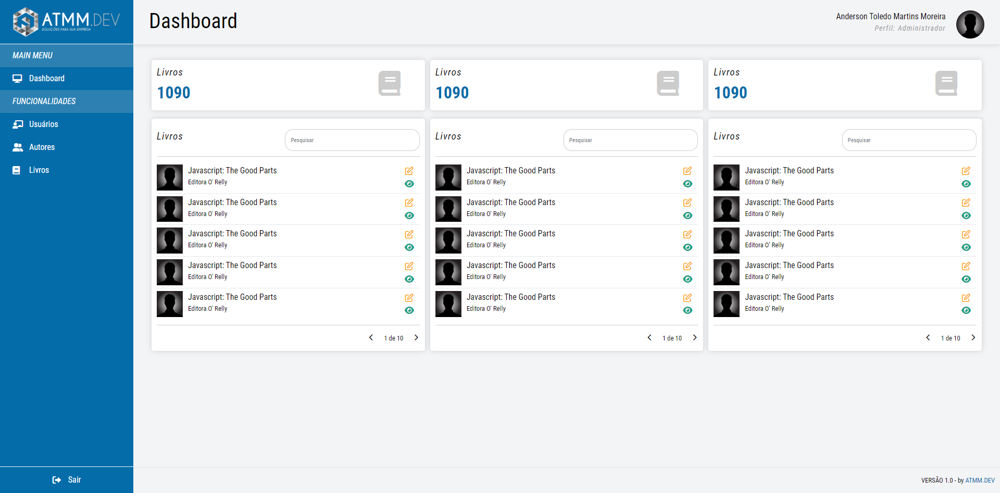
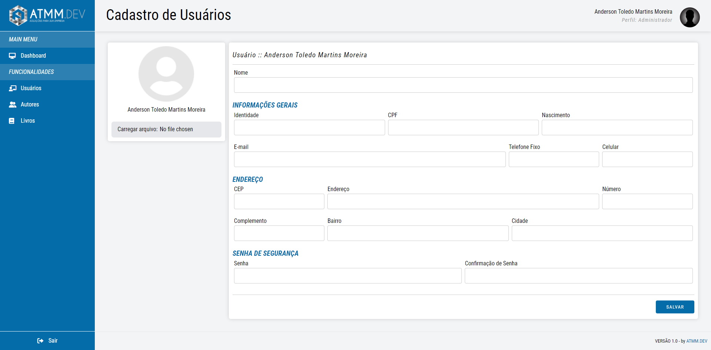
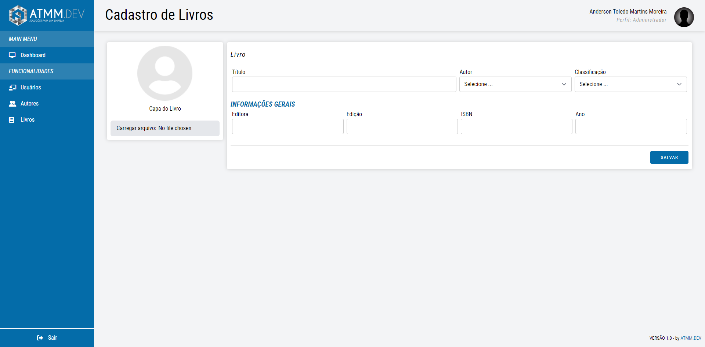
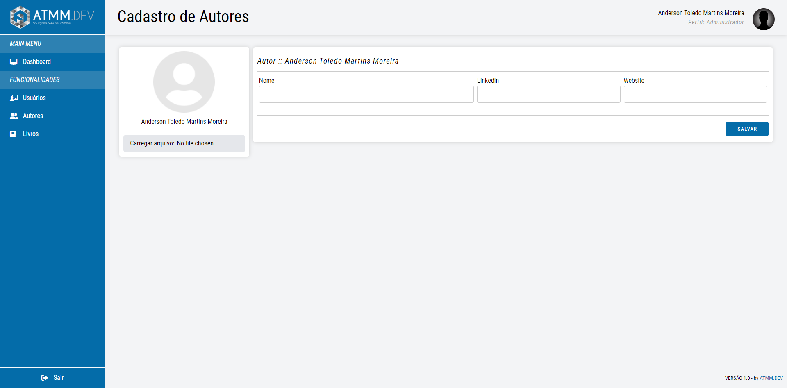

     
    <h1>Anderson Martins</h1>
    <h4>
        Frontend Web UI Developer  
        <a href="https://github.com/atmmoreira" target="_blank">GitHub</a> - <a href="http://www.atmm.dev/cv" target="_blank">Resume</a>  
    </h4>

 
<!-- References for Create budgets :: https://shields.io/category/build -->

        

 

> Description of project

This is a project to learn Vue, with a boilerplate made with html, css, tailwindcss and javascript. The project have some pages: Login, Register, Forgot Password, Dashboard, Register Books, Register Authors and Users.   

`OBSERVATION :: This project was not created with responsiveness because the idea is to create a mobile application with React Native in the future.` 

 

> Functionalities
- Dashboard
- Forgotten password
- Login
- Register
- CRUD's
  - Users
  - Books
  - Authors
  
 

> Screens layout

    Login   
    Register    
    Forgott Password    
    Dashboard   
    Register Users   
    Register Books   
    Register Authors   

 

> Tools

    
    
    
    
    
    
    

 

> Run the project

- `Step 01` - Open the folder project. In this folder you will find the project in react.
- `Step 02` - Inside the folder project. You need follow some steps to run the project.
    - npm install - if you download the project or clone this repository to install dependencies.
    - npm start - to starts the development server.
    - npm test - if you want to starts the test runner.
    - npm run build - to generate bundles the app into static files for production.